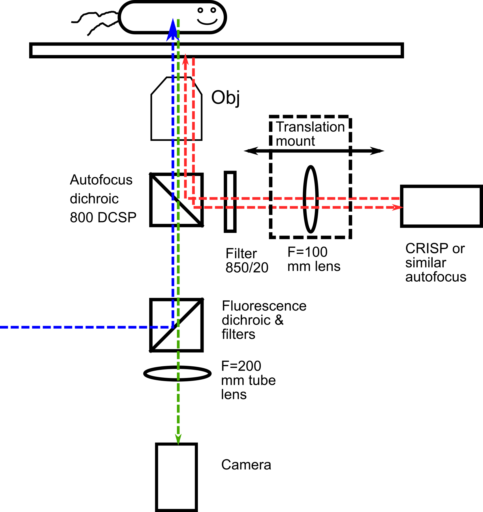
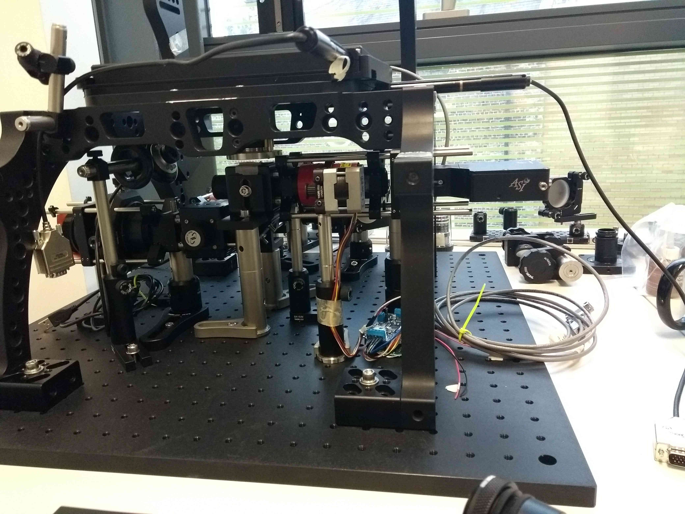
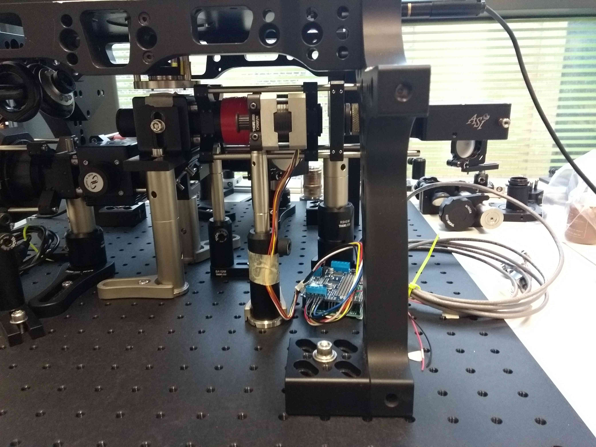
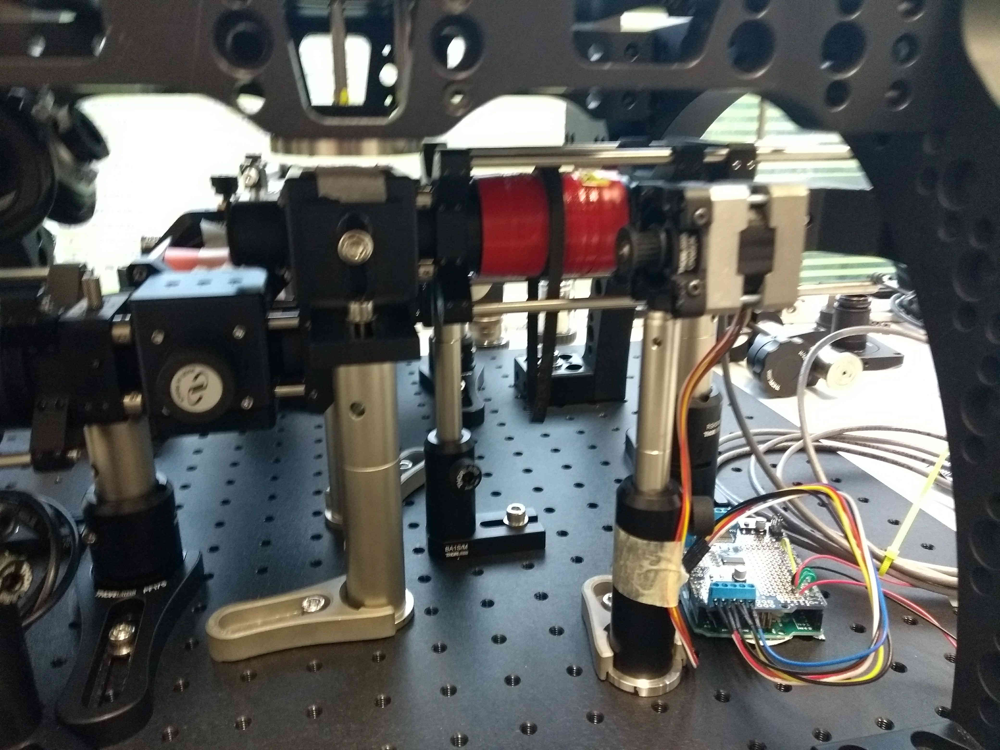
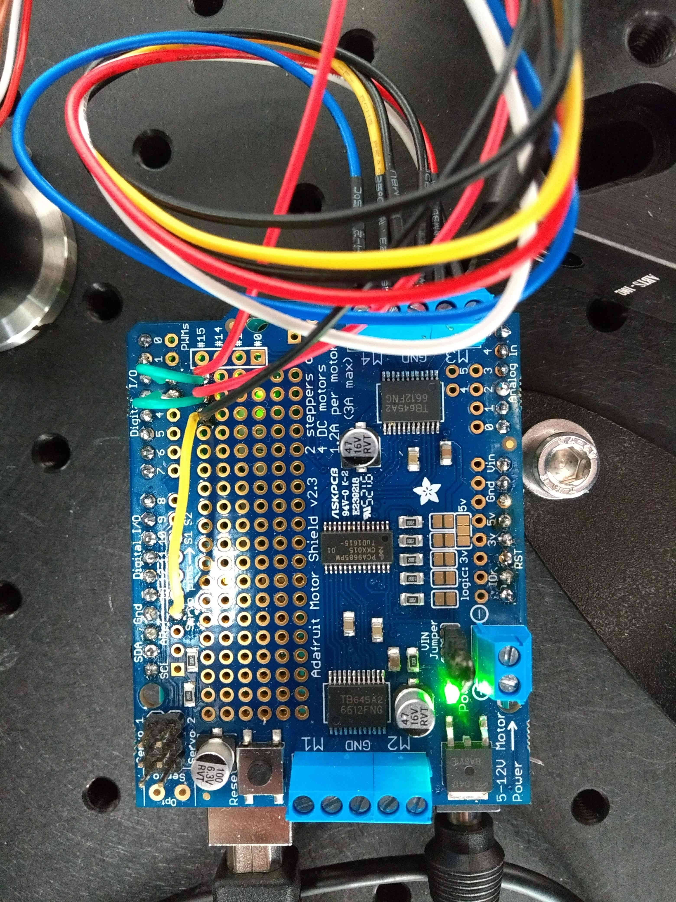
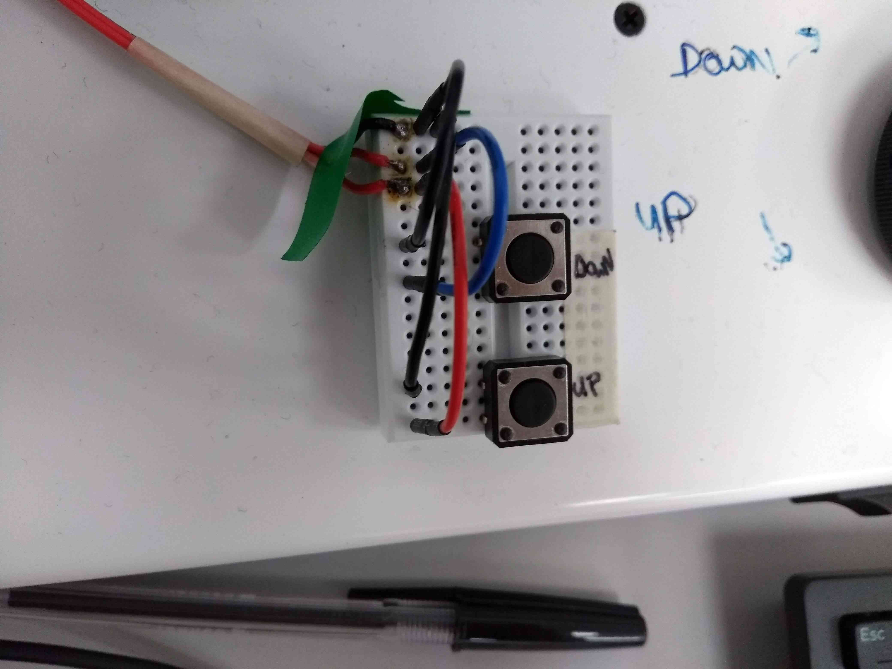

# FocusShifter: Arduino-based microscope autofocus control
_To add in-sample offset shift to reflection autofocus systems (either home built or commercial systems such as the ASI CRISP)_

We developed an Arduino based controller for shifting the focus lock position of reflection based autofocus systems. 

## Items required
### Electronics:
- ASI crisp or other reflection based autofocus system
- Arduino Uno
- Adafruit motor shield v2.3
- 12V stepping motor, Unipolar Hybrid Stepper Motor 1.8°, 0.10Nm, 12 V dc, 400 mA, 6 Wires RS Stock No. 191-8299
- PCB headers
- 12V power supply: Plugtop PSU UK unregulated 3-12Vdc 6W RS Stock no.: 6158880
- Pulley: MXL Plastic Pulley with insert teeth 18 RS Stock no.: 7784714
- 2x MXL Rubber Timing Belt W1/4, L 12.00 in.  RS Stock no.: 7785089
- Mini breadboard
- Wires
- 2x push switches
### Optics & Optomechanics
- 1” F=100mm biconvex lens (NIR coated)
- SM1 Zoom Housing for Ø1" Optics, Non-Rotating, 2" (50.8 mm) Travel SM1NR1
- Zoom housing ? cage adaptors:
- 2x LCP02/M
- SM1T10 SM1 (1.035"-40) Coupler, External Threads, 1" Long
- Motor to ½” post adaptor: CP06F/M
- 20 cm of cage rods
- CRISP mounted on cage plate adaptor:
- LCP01/M
- SM2A6
- C Mount to SM1 thread adaptor.

## Background
We use a reflection based ASI CRISP to maintain focus on our microscope. Similar to many other systems, it reflects an IR beam off a coverslip, and uses shifts in the position of this beam to maintain constant objective-slide separation by closed loop control. 
The limitation of this approach is that this approach only allows you to lock focus at/ very near to the coverslip, in a range < 1 um for a 100x high NA objective, or optionally, to offset the lock position a fixed amount by physically displacing the autofocus device. We wanted to image cells at different heights within the same sample, so this approach was not sufficient for us. 
In our case the autofocus system on our custom microscope has its own beam path and tube lens, before the fluorescence path, separated by a dichroic short pass. Because the autofocus has its own tube lens we were able to produce large changes in the lock position by implementing a motorized Arduino controlled tube lens on the autofocus beam path. This effectively offsets the lock position (the coverslide) and the camera/ excitation focus by a variable amount, in our case allowing ~ 10 um of lock range on 100x NA 1.49 TIRF objective, instead of the standard <1 um with a fixed autofocus tube lens.
Very briefly, we mounted a 100mm focal length lens on a zoom lens housing and motorized the zoom lens with an Arduino and a stepper motor.
Code, some photos, and brief notes are supplied to help others use the same approach.
Although this implementation is built around an ASI CRISP, in principle it should work for any commercial or home built autofocus system. 

## Basic instructions/ notes
- The Thorlabs zoom lens housing is controlled with a stepper motor, connected via a pulley and timing belt. Bizarrely, I could not find an easy out of the box way of adding pulley teeth to a cylindrical object (the zoom housing). As our application was low torque, I took the very low tech approach of chopping up a second timing belt, and gluing it inside out onto the outside of the zoom housing. The glued timing belt then acts as a makeshift pulley. 
- Wire the motor to the Adafruit control board in 6-wire configuration.
- Ensure to connect an external 12V power supply to the Arduino board to supply sufficient power to the motor.
- Code is included to control the stepper motor and microscope focus via Arduino. Download the Arduino IDE, and open the Arduino focus-controller.ino sketch. Install the _Adafruit\_Motor\_Shield\_V2\_Library_ via the _Sketch\>Include Library\>Manage Libraries_ interface. Upload the code to the Arduino board.
- Connect to the Arduino board and control the motor using the Arduino (or any other) serial monitor interface.
- In addition to serial monitor control, I also added a very basic UP/ DOWN  manual control with two push buttons wired to Arduino digital I/O pins.
- Axial magnification is proportional to the square of the lateral magnification. In order for a tube lens shift of several mm to cause sufficient focal shift, we need to use a shorter focal length tube lens for the autofocus, compared to the imaging tube lens. In our case, the (Nikon) imaging tube lens is f=200mm, and the autofocus is f=100mm, reducing the axial autofocus magnification by a factor of 4 – this gives us an ~10 um lock range.

## Photos

Autofocus diagram:

Autofocus photos:

Arduino wiring:

World's worst control pad:

